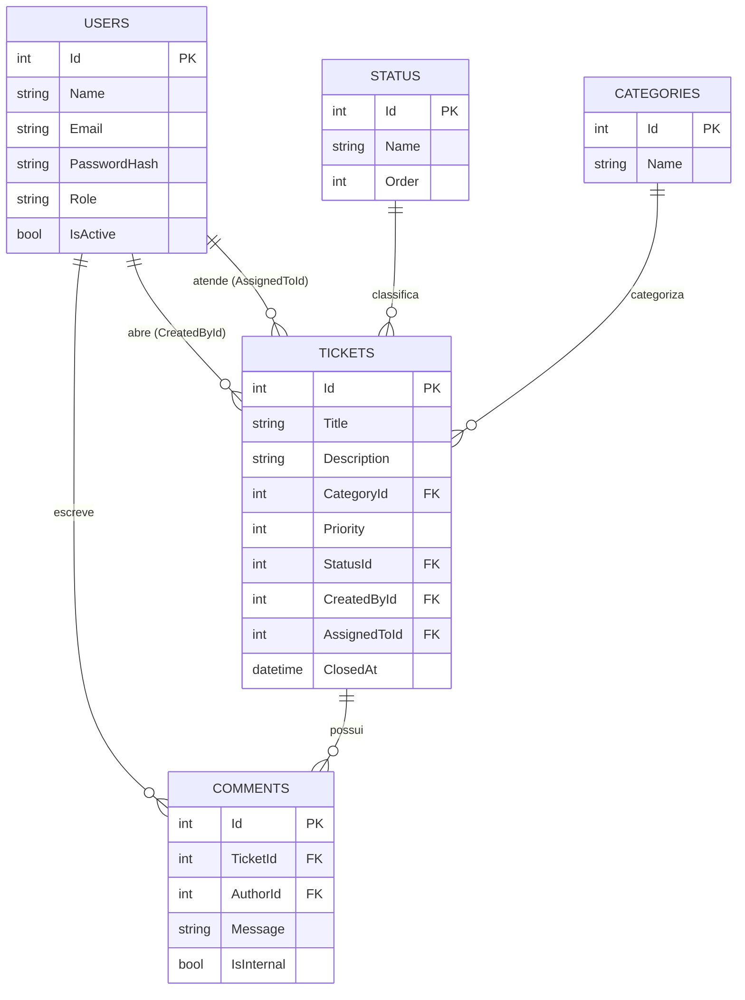
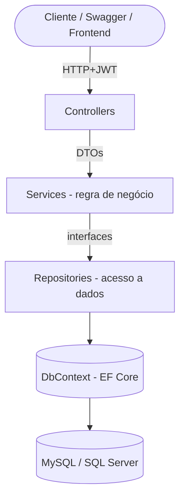
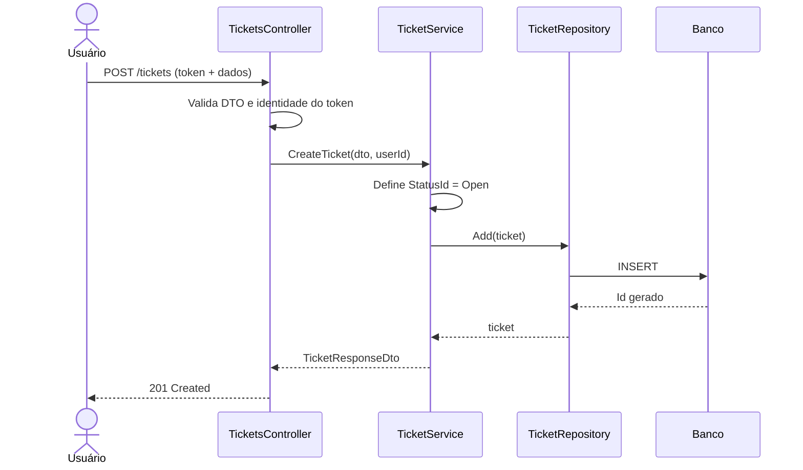
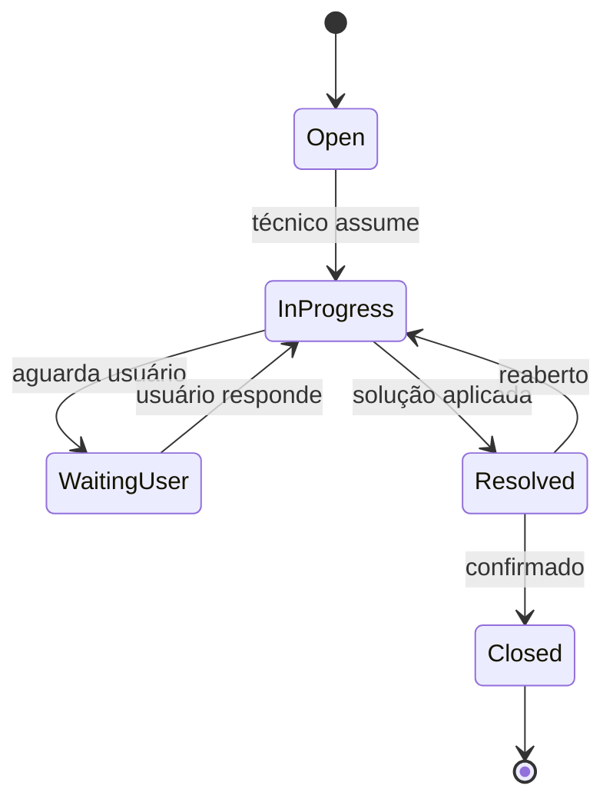

 # 📘 Documentação Técnica — Sistema de Service Desk / Gestão de Chamados

> Projeto de aprendizado e portfólio · ASP.NET Core Web API · EF Core · JWT · Swagger
> Nível: iniciante/intermediário · Padrões profissionais de mercado

---

## 1. Visão Geral do Sistema

### Objetivo
Sistema web (API REST) que simula o ambiente de TI de uma empresa, onde colaboradores abrem **chamados** (tickets) de suporte e técnicos os atendem até a resolução, com rastreamento de status e histórico.

### Problema que resolve
Em empresas sem ferramenta dedicada, chamados chegam por e-mail, chat ou verbalmente — sem rastreabilidade, priorização ou histórico. O sistema centraliza solicitações, registra todo o ciclo de vida do atendimento e dá visibilidade de carga de trabalho e SLA.

### Público-alvo
- **Usuário comum** — qualquer colaborador que precisa de suporte de TI.
- **Técnico de TI** — responsável por atender e resolver chamados.
- **Administrador** — gestor que supervisiona o sistema, usuários e indicadores.

---

## 2. Requisitos Funcionais

### 🧑 Usuário comum
- Autenticar-se (login/logout).
- Abrir novo chamado (título, descrição, categoria, prioridade).
- Listar seus próprios chamados.
- Visualizar detalhe e histórico de um chamado seu.
- Adicionar comentários ao próprio chamado.
- Acompanhar o status (mudanças em tempo real ao consultar).
- Reabrir um chamado fechado (opcional/evolução).

### 🔧 Técnico de TI
- Listar chamados atribuídos a ele e chamados não atribuídos (fila).
- Assumir/atribuir-se um chamado.
- Atualizar status (Em andamento, Aguardando usuário, Resolvido).
- Adicionar comentários internos e públicos.
- Encerrar chamado registrando solução.
- Filtrar chamados por status, prioridade e categoria.

### 👑 Administrador
- Tudo que o técnico pode fazer.
- Gerenciar usuários (criar, listar, ativar/desativar, alterar perfil/role).
- Atribuir/reatribuir chamados a qualquer técnico.
- Visualizar todos os chamados do sistema.
- Acessar indicadores (total por status, por técnico, tempo médio de resolução).
- Gerenciar categorias e status (opcional/evolução).

---

## 3. Requisitos Não Funcionais

| Categoria | Requisito |
|---|---|
| **Segurança** | Autenticação via JWT; senhas com hash (BCrypt/PBKDF2); autorização por role (`[Authorize(Roles=...)]`); HTTPS obrigatório. |
| **Performance** | Respostas < 500 ms em consultas comuns; paginação em listagens; queries com índices nas colunas filtradas. |
| **Escalabilidade** | API stateless (token contém identidade) → permite escalar horizontalmente. |
| **Manutenibilidade** | Arquitetura em camadas, SOLID, injeção de dependência, DTOs separados das entidades. |
| **Disponibilidade** | Tratamento global de erros (middleware); logs estruturados (Serilog). |
| **Usabilidade** | Documentação interativa via Swagger; mensagens de erro claras e padronizadas. |
| **Auditoria** | Registro de quem criou/alterou e quando (CreatedAt/UpdatedAt em todas as entidades). |
| **Validação** | Validação de entrada (FluentValidation ou DataAnnotations) antes de chegar à regra de negócio. |

---

## 4. Modelagem de Banco de Dados

### Entidades principais
`User`, `Ticket`, `Comment`, `Status`, `Category` (apoio), `Priority` (pode ser enum).

### Tabela: `Users`
| Campo | Tipo | Observação |
|---|---|---|
| Id | int / GUID | PK |
| Name | varchar(120) | obrigatório |
| Email | varchar(160) | único, obrigatório |
| PasswordHash | varchar(255) | nunca armazenar senha pura |
| Role | varchar(20) / enum | `User`, `Technician`, `Admin` |
| IsActive | bit | soft delete / desativação |
| CreatedAt | datetime | |
| UpdatedAt | datetime | nullable |

### Tabela: `Tickets`
| Campo | Tipo | Observação |
|---|---|---|
| Id | int / GUID | PK |
| Title | varchar(150) | obrigatório |
| Description | text | obrigatório |
| CategoryId | int (FK) | → Categories |
| Priority | tinyint / enum | `Low`, `Medium`, `High`, `Critical` |
| StatusId | int (FK) | → Status |
| CreatedById | FK | → Users (quem abriu) |
| AssignedToId | FK nullable | → Users (técnico responsável) |
| CreatedAt | datetime | |
| UpdatedAt | datetime | nullable |
| ClosedAt | datetime nullable | preenchido ao encerrar |

### Tabela: `Comments`
| Campo | Tipo | Observação |
|---|---|---|
| Id | int / GUID | PK |
| TicketId | FK | → Tickets |
| AuthorId | FK | → Users |
| Message | text | obrigatório |
| IsInternal | bit | comentário visível só a técnicos/admin |
| CreatedAt | datetime | |

### Tabela: `Status`
| Campo | Tipo | Observação |
|---|---|---|
| Id | int | PK |
| Name | varchar(40) | `Open`, `InProgress`, `WaitingUser`, `Resolved`, `Closed` |
| Order | int | ordem de exibição |

### Tabela: `Categories` (apoio)
| Campo | Tipo | Observação |
|---|---|---|
| Id | int | PK |
| Name | varchar(60) | ex.: Hardware, Software, Rede, Acesso |

### Relacionamentos
- `User 1—N Ticket` (como criador) → `Tickets.CreatedById`.
- `User 1—N Ticket` (como responsável) → `Tickets.AssignedToId`.
- `Ticket 1—N Comment`.
- `User 1—N Comment`.
- `Status 1—N Ticket`.
- `Category 1—N Ticket`.

### Diagrama de entidades


---

## 5. Arquitetura Sugerida (em camadas)

Arquitetura simples de 4 camadas lógicas, fácil de evoluir para Clean Architecture depois.



| Camada | Responsabilidade | NÃO faz |
|---|---|---|
| **Controllers** | Receber requisição HTTP, validar entrada, devolver resposta. | Regra de negócio, acesso ao banco. |
| **Services** | Orquestrar regra de negócio, transformar Model ↔ DTO, decidir fluxos. | Falar HTTP, montar SQL. |
| **Repositories** | Consultas e persistência via EF Core, isolando o DbContext. | Regra de negócio. |
| **Data (DbContext)** | Mapear entidades, migrations, conexão. | Lógica de aplicação. |
| **DTOs** | Contratos de entrada/saída da API (request/response). | Refletir 1:1 a tabela. |
| **Models (Entities)** | Representação do domínio mapeada no banco. | Ser exposta direto na API. |

Princípios aplicados: **Injeção de Dependência** (registrar Services/Repositories no `Program.cs`), **dependência por interface** (`ITicketService`, `ITicketRepository`), **separação Model/DTO** (segurança e desacoplamento).

---

## 6. Fluxos Principais do Sistema

### 6.1 Criar chamado


### 6.2 Atribuir técnico
1. Técnico/Admin chama `PATCH /tickets/{id}/assign`.
2. Service valida se o alvo tem role `Technician`/`Admin`.
3. Preenche `AssignedToId` e muda status para `InProgress`.
4. Persiste e registra comentário interno automático ("Atribuído a X").

### 6.3 Atualizar status
1. Técnico chama `PATCH /tickets/{id}/status`.
2. Service valida transição permitida (ex.: não ir de `Open` direto para `Closed`).
3. Atualiza `StatusId` e `UpdatedAt`.

### 6.4 Encerrar chamado
1. Técnico chama `PATCH /tickets/{id}/close` com a solução.
2. Service define `StatusId = Resolved/Closed`, preenche `ClosedAt`.
3. Adiciona comentário com a descrição da solução.

### 6.5 Ciclo de vida do status


---

## 7. Estrutura Inicial do Projeto

```
HelpDesk.sln
└── src/
    └── HelpDesk.API/
        ├── Program.cs
        ├── appsettings.json
        ├── Controllers/
        │   ├── AuthController.cs
        │   ├── TicketsController.cs
        │   ├── CommentsController.cs
        │   └── UsersController.cs
        ├── Models/                # Entidades de domínio
        │   ├── User.cs
        │   ├── Ticket.cs
        │   ├── Comment.cs
        │   ├── Status.cs
        │   └── Category.cs
        ├── DTOs/
        │   ├── Auth/ (LoginRequest, LoginResponse)
        │   ├── Tickets/ (CreateTicketRequest, TicketResponse, UpdateStatusRequest)
        │   └── Users/ (CreateUserRequest, UserResponse)
        ├── Services/
        │   ├── Interfaces/ (ITicketService, IAuthService, ...)
        │   ├── TicketService.cs
        │   ├── AuthService.cs
        │   └── UserService.cs
        ├── Repositories/
        │   ├── Interfaces/ (ITicketRepository, IUserRepository, ...)
        │   ├── TicketRepository.cs
        │   └── UserRepository.cs
        ├── Data/
        │   ├── AppDbContext.cs
        │   ├── Configurations/   # IEntityTypeConfiguration por entidade
        │   └── Seed/             # dados iniciais (status, admin)
        ├── Security/
        │   ├── JwtTokenGenerator.cs
        │   └── PasswordHasher.cs
        ├── Middlewares/
        │   └── ExceptionHandlingMiddleware.cs
        └── Migrations/           # gerado pelo EF Core
```

> Comece tudo dentro de `HelpDesk.API`. Quando o projeto crescer, mova `Models/Services/Repositories/Data` para projetos separados (`.Domain`, `.Application`, `.Infrastructure`) — evolução natural para Clean Architecture.

---

## 8. Sugestão de Endpoints da API

### Auth
| Método | Rota | Acesso | Descrição |
|---|---|---|---|
| POST | `/auth/register` | Admin | Cria usuário |
| POST | `/auth/login` | Público | Retorna JWT |

### Tickets
| Método | Rota | Acesso | Descrição |
|---|---|---|---|
| POST | `/tickets` | User+ | Abre chamado |
| GET | `/tickets` | Técnico/Admin | Lista todos (com filtros + paginação) |
| GET | `/tickets/mine` | User | Lista chamados do usuário logado |
| GET | `/tickets/{id}` | Dono/Técnico/Admin | Detalhe |
| PUT | `/tickets/{id}` | Dono/Técnico | Edita dados |
| PATCH | `/tickets/{id}/assign` | Técnico/Admin | Atribui técnico |
| PATCH | `/tickets/{id}/status` | Técnico/Admin | Muda status |
| PATCH | `/tickets/{id}/close` | Técnico/Admin | Encerra com solução |

### Comments
| Método | Rota | Acesso | Descrição |
|---|---|---|---|
| POST | `/tickets/{id}/comments` | Participantes | Adiciona comentário |
| GET | `/tickets/{id}/comments` | Participantes | Lista comentários |

### Users / Métricas
| Método | Rota | Acesso | Descrição |
|---|---|---|---|
| GET | `/users` | Admin | Lista usuários |
| PATCH | `/users/{id}/role` | Admin | Altera perfil |
| PATCH | `/users/{id}/status` | Admin | Ativa/desativa |
| GET | `/dashboard/summary` | Admin | Indicadores gerais |

Filtros recomendados em `GET /tickets`: `?status=&priority=&category=&assignedTo=&page=&pageSize=`.

---

## 9. Sugestão de Evolução Futura

- **Notificações por e-mail** — avisar usuário a cada mudança de status (SMTP / SendGrid).
- **Dashboard** — frontend (React/Blazor) consumindo `/dashboard/summary` com gráficos.
- **SLA e prazos** — calcular tempo de resposta/resolução e alertar atrasos.
- **Refresh Token** — sessões mais seguras e longas.
- **Anexos** — upload de arquivos/prints no chamado (armazenar em Azure Blob/S3).
- **Logs e auditoria** — Serilog + tabela de histórico de alterações.
- **Testes** — unitários (xUnit) nos Services e de integração nos Controllers.
- **Containerização** — Docker + docker-compose (API + banco).
- **Deploy em Azure** — Azure App Service + Azure SQL.
- **CI/CD** — pipeline no Azure DevOps ou GitHub Actions (build → testes → deploy).
- **Cache** — Redis para listagens e métricas frequentes.

---

## 🛠️ Roteiro sugerido de desenvolvimento (passo a passo)

1. Criar projeto Web API + configurar Swagger.
2. Modelar entidades + `AppDbContext` + primeira migration.
3. Implementar Repositories e Services de `User`.
4. Implementar Auth (hash de senha + geração de JWT) e proteger rotas.
5. Implementar CRUD de Tickets (criar → listar → detalhe).
6. Adicionar fluxos: assign, status, close.
7. Implementar Comments.
8. Adicionar autorização por role e validações.
9. Middleware global de erros + paginação.
10. Dashboard/métricas → depois partir para a seção de evolução.
